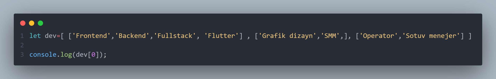

# array
## array - JavaScriptdagi array qator elementlardan iborat, har biri indeks bilan belgilanadi. Massivlar turli xil ma'lumotlarni o'z ichiga oladi va ularga kiritish, o'qish, o'zgartirish va o'chirish imkoniyatini beradi.
## Arrayda indexlar "0" dan boshlanadi.

## Masalan bu kodda  "dev" array bor uning ichida ham 3 array joylashgan.Biz <code>console.log(dev[0]);</code>  chaqirganimizda   1 blokni chiqardi.
## Agar biz <code>console.log(dev[1]);</code> chaqirganimizda 2 blok ichida turgan elementlarni chiqarib beradi. 
    
# Quyidagilar array bilan ishlashda  foydalaniladi.

# 1. push -  yordamida arrayning oxiriga yangi element qo'shiladi.

## Bu kodda <code>dev.push('Kiber sport')</code> push qilganimizda  element oxiridan qoshib berdi.
   

# 2. pop -  yordamida arrayning oxiridagi elementni o'chiradi.

## Bu kodda <code>dev.pop(2)</code> ".pop" yozib 2indexni ko'rsatganimzida   
## oxirgi elementni ochirib berdi.