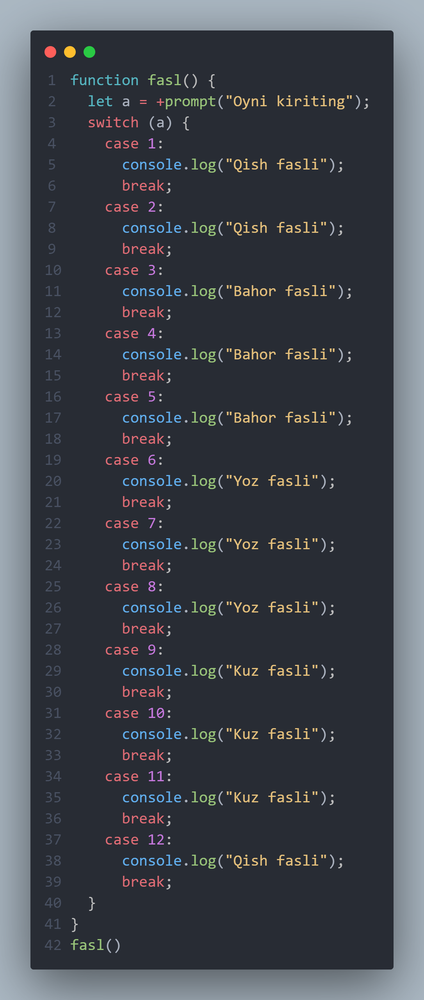
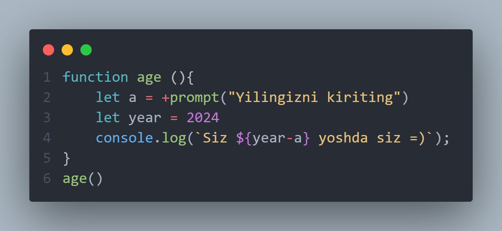
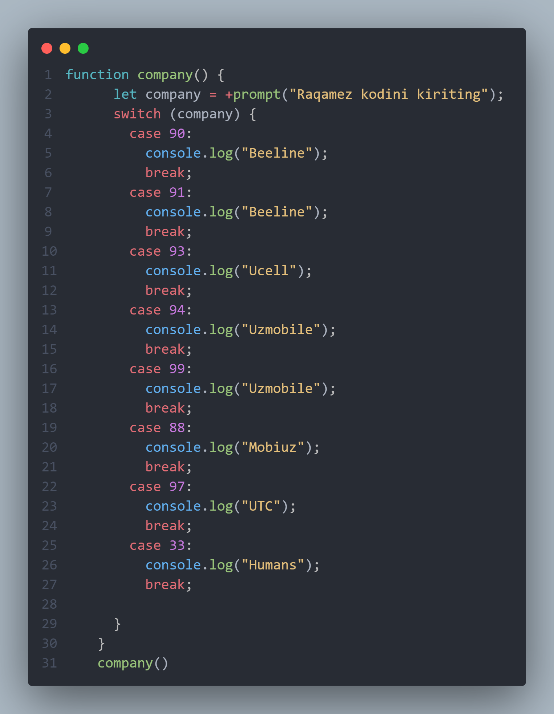
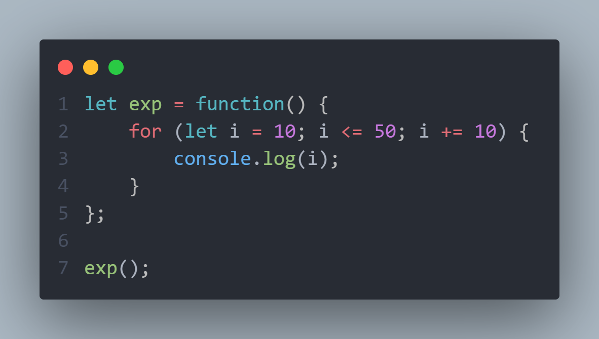
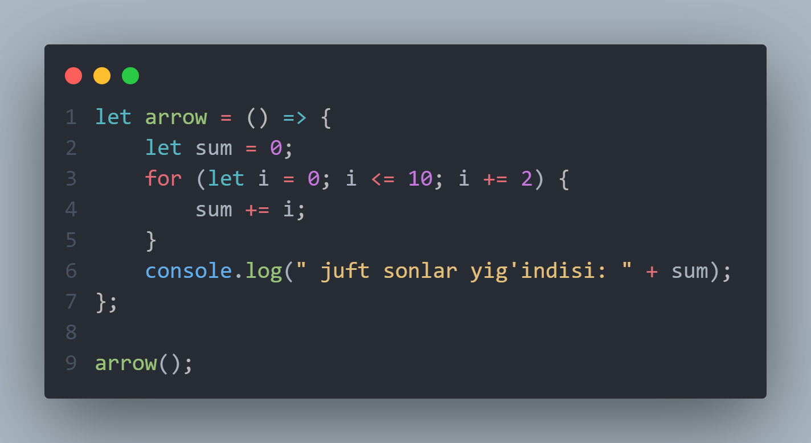

# Functions
## Function Decloartion
## Function Expression
## Function Arrow
     

# Function Decloration
## Quyidagi kodda oy raqami kiritilsa Qaysi fasli ekanini aniqlovchi funksiya yozilgan.

   

##  Bu koda esa  yoshingizni aniqlovchi funksiya yozilgan.
 
   

## Bu kodda Telefon raqam kodiga qarab qaysi "Operator" ekanini aniqlovchi dastur yozilgan.

    

# FUNCTION EXPRESSION 
## Quyidagi kodda 0 da 50 gacha bo'lgan sonlar ichidan faqat 10liklarini chiqaruvchi programma tuzilgan.

    

# Function Arrow
## Quyidagi misolda "function arrow" bilan 0 dan 10 gacha bo'lgdan sonlar ichidan jufllarini yig'indisini aniqlovchi programma tuzilgan.

