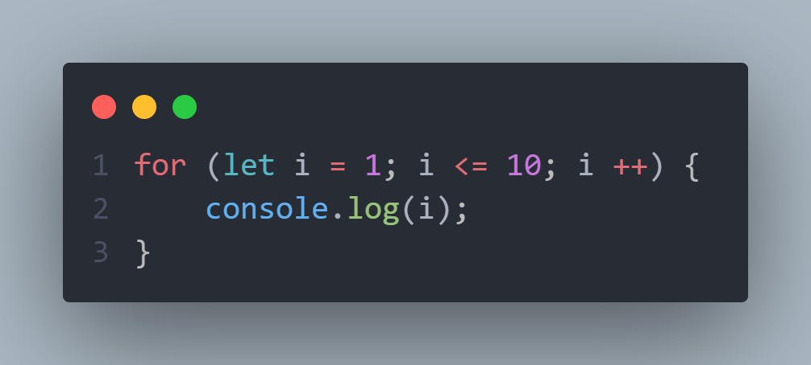

# LOOP

## 1. do while
## 1. while
## 1. for
   

# do while - kodni bajarishdan oldin shartni tekshiradi.
## do while for examle:
### 1.Bu misolda 0da 20gacha bo'lgan sonlarni chiqarish mumkin

  

### 2.Bu misolda 0da 20gacha bo'lgan sonlar ichinda faqat juftlarining yig'indisini chiqarish mumkin.

      

# while -  biror shart bajarilgunga qadar kodni takrorlaydi. Shart to'g'ri bo'lganda amal bajariladi.

## while for example:
### Bu misolda 0 boshlab 10 gacha bo'lgan sonlar ichidan faqat juftlarini chiqarish mumkin.

      

# for -  ko'p   vazifalarni bajarish uchun ishlatiladi. U yordamida  belgilangan shart bajarilgunga qadar kodni bir necha marta takrorlasa bo'ladi.
## for - for example:
### 1. Bu kodda for orqali 1 dan 10 gacha bo'lgan sonlarni chiqarish mumkin.

  

### 2.Bu kodda for orqali 1dan 10 gacha bo'lgan sonlar ichidan faqat toqlarini chiqarish mumkin.

